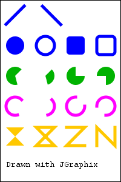
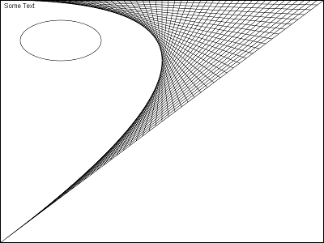

# JGraphix &ndash; a simple setup for drawing 2D graphics in Java

Though drawing graphics in Java is fun and eventually easy, getting the surrounding setup right
can be a real challenge (not only) for beginning programmers.
This package provides a simple setup for performing non-interactive drawing
operations in Java and makes it extremely easy to get started with graphics. 
No need to know about listeners, callbacks, threads or similar advanced concepts.
The software is intended for educational (student) use and thus neither safe nor
recommended for real applications. The implementation is based on Swing and AWT 
graphics. All standard AWT graphics operations can be used (see the
<a href="https://docs.oracle.com/javase/8/docs/api/index.html?java/awt/Graphics.html">Graphics</a> 
and
<a href="https://docs.oracle.com/javase/8/docs/api/index.html?java/awt/Graphics2D.html">Graphics2D</a> 
API documentation for details).
The rendered screen graphics can be saved to a PNG file by pressing
Ctrl-s (Windows) or Cmd-s (MacOS) on the open window.

  



## Installation

* **Option 1:** Download the JAR file from [jars/](https://github.com/imagingbook/JGraphix/tree/master/jars)
and add it to your Java project (add to build path).
* **Option 2:** Clone this repository and open the contained (Eclipse) project.

Requires Java 1.7 or higher.

## Typical Usage

````
import java.awt.Color;
import java.awt.Font;
import java.awt.Graphics2D;
import java.awt.geom.Line2D;

import imagingbook.jgraphix.DrawFrame;

...

DrawFrame df = DrawFrame.create();
Graphics2D g = df.getGraphics2D();
   
g.setStroke(new BasicStroke(5));
g.setColor(Color.blue);
   
g.drawLine(40, 10, 10, 40);
g.fillOval(10, 60, 30, 30);
g.drawOval(60, 60, 30, 30);
df.refresh();	// display drawing
 
df.clear();	// erase drawing
g.setColor(Color.green);
g.fillRoundRect(110, 60, 30, 30, 10, 10);
g.drawRoundRect(160, 60, 30, 30, 10, 10);
df.refresh();	// display drawing
...  
````

## More Examples
https://github.com/imagingbook/JGraphix/tree/master/examples

## Documentation
https://imagingbook.github.io/JGraphix/javadoc/index.html
